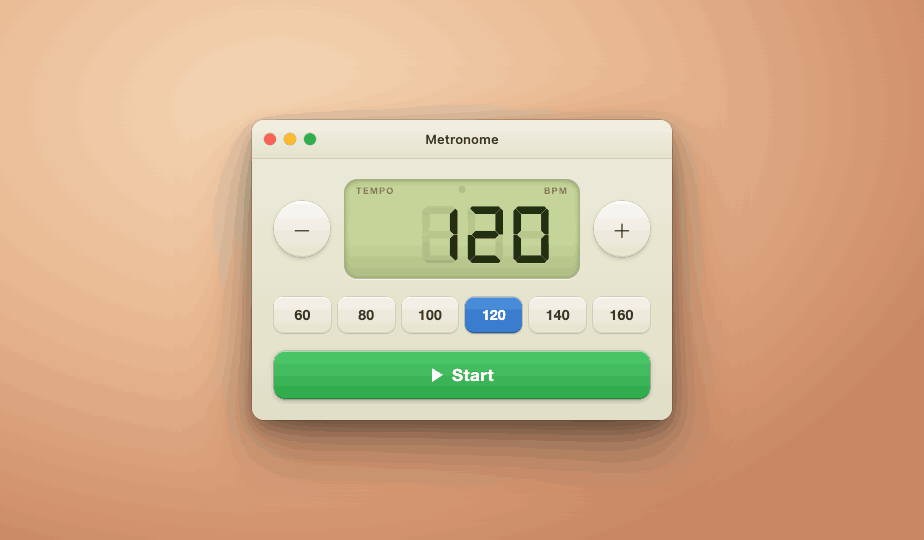

# EZ Metronome

EZ Metronome is a small native macOS metronome built with AppKit, SwiftUI, and AVFoundation. The app uses a fixed-size window with an LCD-style tempo display, plus/minus tempo controls, quick tempo presets, and a start/stop transport button.



## Current Behavior

- Tempo range: 30-300 BPM.
- Default tempo: 120 BPM.
- Quick presets: 60, 80, 100, 120, 140, and 160 BPM.
- Plus/minus buttons support single-click changes and accelerating press-and-hold changes.
- Space toggles start/stop.
- Up/down arrows increment and decrement tempo.
- Audio clicks are generated at runtime with `AVAudioEngine` and scheduled on an `AVAudioPlayerNode`.
- The first beat of each four-beat group can be accented from `Options > Accent First Beat`.
- The app menu includes `Hide the Metronome`, `Exit`, and a Help item that shows version/build information.

## Project Layout

```text
.
|-- Metronome.xcodeproj/          Xcode project for the macOS app target
|-- Metronome/                    Application source and bundled resources
|   |-- MetronomeApp.swift        AppKit entry point, window creation, app menu
|   |-- ContentView.swift         SwiftUI controls and keyboard handling
|   |-- MetronomeModel.swift      Main UI/audio state model
|   |-- MetronomeAudioEngine.swift Runtime click synthesis and beat scheduling
|   |-- DesignTokens.swift        Shared layout, tempo, and color constants
|   |-- FontRegistrar.swift       Runtime registration for the bundled LCD font
|   |-- WindowConfigurator.swift  Reusable AppKit window configuration helper
|   |-- Info.plist                Bundle metadata template
|   |-- Metronome.icns            App icon
|   |-- Assets.xcassets/          App icon and accent color asset catalog
|   `-- Fonts/                   DSEG7 LCD font and its license
|-- screenshots/                  UI screenshots used by the README/spec
|-- reference/                    Original HTML/React visual prototype
|-- site/                         Static landing page and release download
|   `-- dist/                     Tracked release DMG installer
|-- Tools/                        App-icon generation helpers
|-- SPEC.md                       Original design and implementation handoff
|-- LICENSE                       GPLv3 license text
`-- README.md                     Project overview and build notes
```

`DerivedData/` and `.DerivedData/` are local build output and are ignored by git. `site/dist/` is tracked intentionally so the repository can include the current release DMG for people who do not want to build the app locally.

## Requirements

- Xcode 26.4.1 or a compatible Xcode version.
- Swift 5.
- macOS SDK/deployment target currently configured in the project: macOS 26.4.

The current project settings build product version `1.0` and build number `1`.

## Build and Run

Open `Metronome.xcodeproj` in Xcode and run the `Metronome` scheme.

Debug build from the command line:

```bash
xcodebuild -project Metronome.xcodeproj -scheme Metronome -configuration Debug -derivedDataPath .DerivedData build
open ".DerivedData/Build/Products/Debug/EZ Metronome.app"
```

Release build from the command line:

```bash
xcodebuild -project Metronome.xcodeproj -scheme Metronome -configuration Release -derivedDataPath .DerivedData -destination generic/platform=macOS build
```

Release output:

```text
.DerivedData/Build/Products/Release/EZ Metronome.app
```

Using `-destination generic/platform=macOS` produces the configured universal macOS build instead of a local-machine-only build.

## Package a DMG

The repo does not currently have a packaging script. A simple drag-to-Applications DMG can be created manually after the Release build:

```bash
rm -rf .dmgroot
mkdir -p .dmgroot site/dist
ditto ".DerivedData/Build/Products/Release/EZ Metronome.app" ".dmgroot/EZ Metronome.app"
ln -s /Applications .dmgroot/Applications
hdiutil create -volname "EZ Metronome" -srcfolder .dmgroot -ov -format UDZO site/dist/EZMetronome-1.0.dmg
rm -rf .dmgroot
```

The app is currently signed by Xcode for local running. Developer ID signing and notarization are not automated in this project.

## Reference Material

`SPEC.md` contains the original detailed design handoff, including target dimensions, colors, interaction timing, audio behavior, and asset notes. The files in `reference/` are prototype/reference material, not production app code.

## License

EZ Metronome is licensed under the GNU General Public License v3.0 or later. See `LICENSE` for the full license text.
